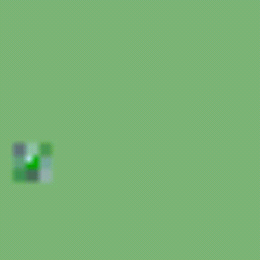
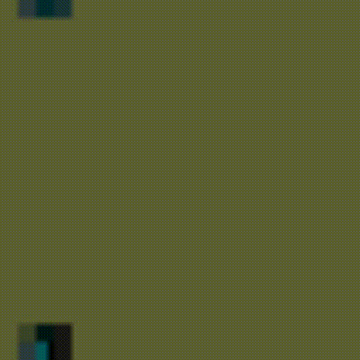
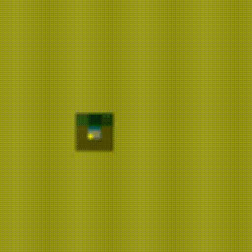

# COMPSCI 715 Group Project

<!--
#### Tile Based (Adjacency extracted from input image relationships)

Flower.png             |  Skyline.png           |    Spirals.png           |  
:-------------------------:|:-------------------------:|:-------------------------:|
 | |

#### Overlap Based (Needs fixing...)
Flower.png             |  Skyline.png           |    Cat.png           |  Red Maze.png           |  
:-------------------------:|:-------------------------:|:-------------------------:|:-------------------------:|
 | ||
-->
### Visualization 
Flower.png             | Red Maze.png| 3Bricks.png | Platformer.png
:-------------------------:|:-------------------------:|:-------------------------:|:-------------------------:|
 | | |

### More Visualizations
 Mountains.png | Rooms.png |Water.png|
 :-------------------------:|:-------------------------:|:-------------------------:|
 [Mountains](./wfc_outputs/Mountains.png.gif)|[Rooms](./wfc_outputs/Rooms.png.gif)|[Water](./wfc_outputs/Water.png.gif)|

### Setup python / enviornment
The code should be python2 and 3 compatible.
But recommended to use python3, since python2 is no longer maintained.

```bash
python -m pip install -r requirements.txt

```
or 
```bash
python3 -m pip install -r requirements.xt
```

If it doesn't work, for instance, if you don't have pip. Download pip https://pip.pypa.io/en/stable/installation/.
Use python from https://www.python.org/.
If using windows, remember to click "Add to system path" when you first install python. Otherwise follow
this to add python to your system path.
(https://geek-university.com/python/add-python-to-the-windows-path/)

### How to run

```bash
python test.py --img_name.png
```
Example:
```bash
python test.py --Flowers.png
```


### TODO

1.Tile Based (Done (Need Revising))

2.Manual adjacency creator (TODO)

3.Overlap Based. (Done)

4.Overlap Based Rotation and Symmetry. (Done)


5.Overlap Backtrack. (Done)

6.Overlap global constraints -> Ground (Done)

7.Overlap more global constraints (TODO)

7.Overlap more global constraints (TODO)


